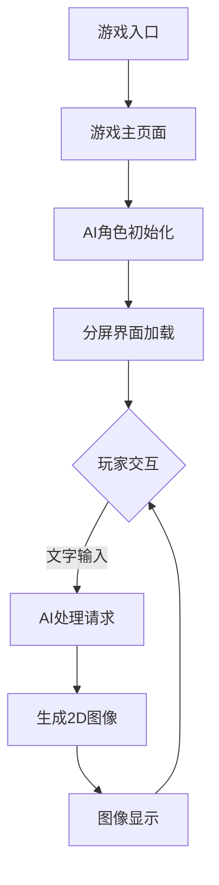

## 1. 产品概述
H5沙盒游戏MVP版本，玩家通过文字终端与AI角色交互。AI根据对话内容生成2D插图显示在画布上，玩家通过对话影响AI生成的图像内容。单页面应用，分屏设计：左侧70%显示AI生成的2D插图，右侧30%为文字终端。无需注册登录，即开即玩。

## 2. 核心功能

### 2.1 用户角色
MVP版本无用户系统，无需注册登录，直接进入游戏体验。

### 2.2 功能模块
MVP版本仅包含单页面：
1. **游戏主页面**：分屏显示AI生成的2D插图和文字终端，AI角色交互

### 2.3 页面详情
| 页面名称 | 模块名称 | 功能描述 |
|----------|----------|----------|
| 游戏主页面 | AI生成2D插图 | 根据对话内容调用大模型生成静态图像，展示AI理解的游戏场景 |
| 游戏主页面 | 文字终端 | 接收玩家文字输入，显示AI角色回复，支持基本对话历史 |
| 游戏主页面 | AI角色系统 | 基于大模型生成文字回复，同时生成对应的2D场景图像 |
| 游戏主页面 | 本地状态管理 | 使用localStorage保存当前对话历史、生成图像URL和对应的视觉提示词，刷新页面后可恢复 |
| 游戏主页面 | 图像生成加载状态 | 生成图像期间显示"数据扫描"动画和系统提示文本 |
| 游戏主页面 | 图像切换过渡效果 | 新旧图像切换时添加CSS淡入淡出动画效果 |

## 3. 核心流程
玩家打开游戏直接进入分屏主界面。左侧显示AI生成的初始2D插图，右侧终端显示欢迎信息。玩家通过文字终端与AI对话，AI理解意图后生成新的2D图像展示场景变化。对话历史保存在本地，刷新页面可恢复。



## 4. 用户界面设计

### 4.1 设计风格
- **主色调**：深灰色(#2D3748)背景，搭配蓝色(#3182CE)交互元素
- **按钮样式**：扁平化设计，圆角4px，悬停状态明显
- **字体**：等宽字体用于终端，无衬线字体用于界面
- **布局风格**：分屏固定比例，左侧游戏画布，右侧终端面板
- **图标风格**：简约线性图标，符合游戏科技主题

### 4.2 页面设计概览
| 页面名称 | 模块名称 | UI元素 |
|----------|----------|--------|
| 游戏主页面 | AI生成2D插图 | 静态2D图像，根据对话内容生成相应场景，图像尺寸适配画布，生成期间显示扫描动画 |
| 游戏主页面 | 文字终端 | 深色主题终端，绿色文字，支持滚动历史记录，图像生成时显示系统状态信息 |
| 游戏主页面 | 分屏布局 | 固定70/30比例分屏，左侧2D图像画布，右侧终端面板 |
| 游戏主页面 | 图像过渡动画 | CSS淡入效果，新旧图像平滑切换，提升视觉体验 |

**界面布局演示：**
```
+---------------------------------------+-----------------------+
|                                       |                       |
|                                       | [STATUS: ONLINE]      |
|                                       | --------------------- |
|                                       | > 系统初始化完成...     |
|          AI 生成的 2D 插图              | > 主，我在观测。       |
|          (70% 宽度)                    |                       |
|                                       | [ 玩家输入框 ]         |
|                                       | [ 发送按钮 ]           |
|                                       |                       |
+---------------------------------------+-----------------------+
```

### 4.3 响应式设计
仅支持桌面端，固定分辨率1366x768以上。分屏比例固定70/30，不支持移动端适配。

### 4.4 AI图像生成指导
- **图像风格**：根据对话内容生成相应风格的2D插图
- **图像尺寸**：适配左侧70%画布区域，保持宽高比
- **生成时机**：每次AI回复时同时生成对应场景的2D图像
- **显示方式**：静态图像，生成期间显示"数据扫描"动画，完成后淡入显示
- **缓存机制**：生成的图像URL和对应的视觉提示词一并保存，支持重新生成
- **过渡效果**：新旧图像切换使用CSS fade-in动画，避免突兀感
- **系统提示**：图像生成期间终端显示"[SYSTEM: 正在同步视觉感知数据...]"