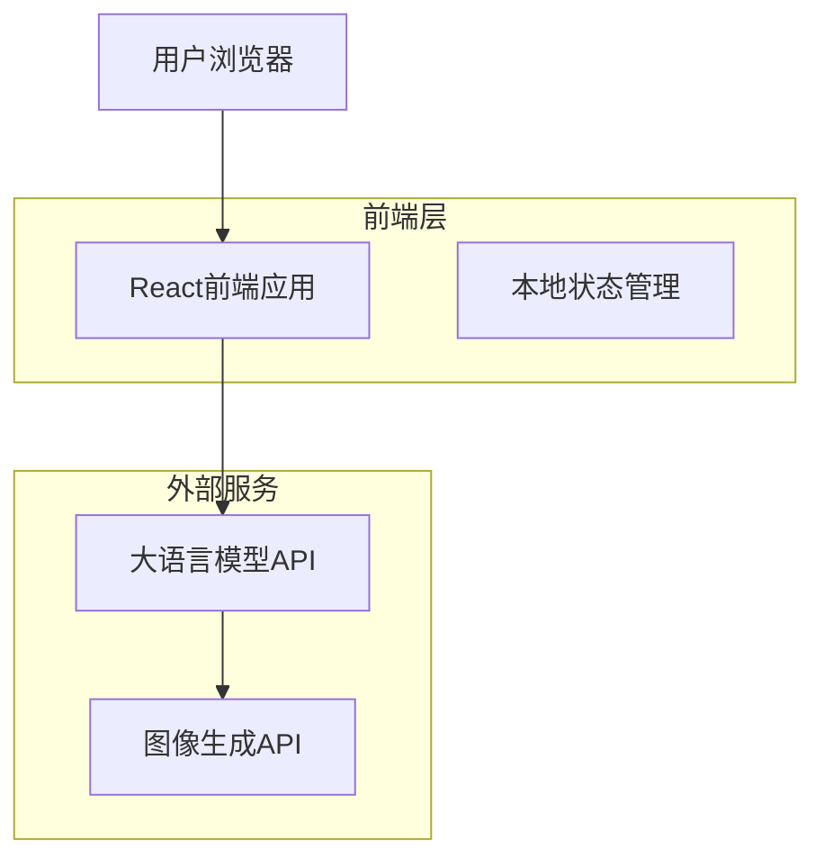

## 1. 架构设计



**界面布局演示：**
```
+---------------------------------------+-----------------------+
|                                       |                       |
|                                       | [STATUS: ONLINE]      |
|                                       | --------------------- |
|                                       | > 系统初始化完成...     |
|          AI 生成的 2D 插图              | > 主，我在观测。       |
|          (70% 宽度)                    |                       |
|                                       | [ 玩家输入框 ]         |
|                                       | [ 发送按钮 ]           |
|                                       |                       |
+---------------------------------------+-----------------------+
```

## 2. 技术描述

- **前端**：React@18 + TailwindCSS@3 + Vite
- **初始化工具**：vite-init
- **后端**：无后端服务，直接调用LLM和图像生成API
- **AI集成**：阿里云百炼千问(Qwen) API + 百炼万相(wanx2.0-t2i-turbo)图像生成API
- **状态管理**：localStorage保存对话历史和生成的图像URL

## 3. 路由定义

| 路由 | 用途 |
|-------|---------|
| / | 游戏主页面，分屏显示游戏世界和文字终端 |

## 4. API定义

MVP版本无后端API，前端直接调用LLM和图像生成API：

**AI对话API（阿里云百炼千问DashScope兼容模式）**
```
POST https://dashscope.aliyuncs.com/compatible-mode/v1/chat/completions
```

请求：
| 参数名 | 参数类型 | 是否必需 | 描述 |
|-----------|-------------|-------------|-------------|
| messages | array | true | 对话历史消息 |
| model | string | true | 模型名称（qwen-turbo） |
| response_format | object | false | 响应格式，设置为 `{type: "json_object"}` |
| stream | boolean | false | 是否流式响应 |

响应格式要求：
AI回复必须包含以下JSON结构：
```json
{
  "text": "给玩家的回复文本",
  "visual_prompt": "用于图像生成的场景描述"
}
```

示例：
```json
{
  "text": "主，我在这片荒原上建造了一座塔。",
  "visual_prompt": "A futuristic tower in a desolate plain, flat 2D illustration style"
}
```

响应：
| 参数名 | 参数类型 | 描述 |
|-----------|-------------|-------------|
| choices | array | AI回复选择 |
| usage | object | Token使用量 |

**图像生成API（百炼万相wanx2.0-t2i-turbo）**
```
POST https://dashscope.aliyuncs.com/api/v1/services/aigc/text2image/image-synthesis
```

**错误处理**：如果百炼模型调用失败，系统将在debug_log中记录错误信息，不会使用备用方案。

请求：
| 参数名 | 参数类型 | 是否必需 | 描述 |
|-----------|-------------|-------------|-------------|
| model | string | true | 模型名称（wanx2.0-t2i-turbo） |
| input.prompt | string | true | 场景描述文本 |
| parameters.style | string | false | 图像风格（默认auto） |
| parameters.size | string | false | 图像尺寸（默认1280*720） |
| n | number | false | 生成图像数量（默认1） |

响应：
| 参数名 | 参数类型 | 描述 |
|-----------|-------------|-------------|
| output.task_id | string | 异步任务ID |
| output.task_status | string | 任务状态（PENDING/RUNNING/SUCCEEDED/FAILED） |
| output.results | array | 生成结果数组，包含图像URL |

**任务查询API**
```
GET https://dashscope.aliyuncs.com/api/v1/tasks/{task_id}
```

## 5. 服务器架构图

MVP版本无服务器架构，前端直接调用LLM API。

## 6. 数据模型

MVP版本无数据库，仅使用localStorage存储对话历史：

```javascript
// 本地存储结构
interface LocalGameState {
    conversationHistory: Array<{
        role: 'user' | 'assistant';
        content: string;
        timestamp: number;
        imageUrl?: string;
        visualPrompt?: string; // 用于重新生成图像的提示词
    }>;
    currentImageUrl?: string;
    currentVisualPrompt?: string; // 当前图像对应的视觉提示词
}
```

### 6.2 本地存储实现

**localStorage键值定义**
```javascript
// localStorage键值定义
const CONVERSATION_KEY = 'h5-sandbox-conversation';
const CURRENT_IMAGE_KEY = 'h5-sandbox-current-image';

// 存储对话历史和当前图像
function saveGameState(history: any[], currentImageUrl?: string, currentVisualPrompt?: string) {
    localStorage.setItem(CONVERSATION_KEY, JSON.stringify(history));
    if (currentImageUrl) {
        localStorage.setItem(CURRENT_IMAGE_KEY, JSON.stringify({
            url: currentImageUrl,
            visualPrompt: currentVisualPrompt
        }));
    }
}

// 读取游戏状态
function loadGameState() {
    const historyData = localStorage.getItem(CONVERSATION_KEY);
    const imageData = localStorage.getItem(CURRENT_IMAGE_KEY);
    const imageObj = imageData ? JSON.parse(imageData) : null;
    return {
        conversationHistory: historyData ? JSON.parse(historyData) : [],
        currentImageUrl: imageObj?.url || null,
        currentVisualPrompt: imageObj?.visualPrompt || null
    };
}

// 清除本地数据
function clearLocalData() {
    localStorage.removeItem(CONVERSATION_KEY);
    localStorage.removeItem(CURRENT_IMAGE_KEY);
}

## 7. 技术实现细节

### 7.1 插画显示
- **实现方式**：使用 `` 标签或 Canvas `drawImage` 方法显示生成的插画
- **样式要求**：应用 CSS `object-fit: cover` 属性确保图像按比例填充容器，避免拉伸变形
- **容器设置**：设置固定宽高比容器，确保图像显示一致性

### 7.2 文字终端
- **容器结构**：使用 `div` 元素作为文字终端容器
- **滚动功能**：设置 `overflow-y: scroll` 样式实现垂直滚动
- **自动滚动**：实现 `scrollToBottom()` 函数，在新增文本时自动滚动到底部，保持最新内容可见
```javascript
function scrollToBottom() {
    const terminal = document.getElementById('text-terminal');
    terminal.scrollTop = terminal.scrollHeight;
}
```

### 7.3 错误处理
- **图像生成失败**：当百炼万相API调用失败时，系统将在debug_log中记录详细错误信息
- **无备用方案**：移除所有Pollinations.ai相关的备用图像生成逻辑
- **用户提示**：在终端中显示"图像生成失败，请稍后重试"的友好提示

### 7.5 状态持久化
- **存储方式**：使用 `window.localStorage` 进行本地数据持久化
- **存储结构**：采用对象格式存储，确保数据结构清晰
```javascript
{
    history: [],        // 对话历史记录
    lastImage: ""       // 最后生成的图像URL
}
```
- **数据同步**：在每次对话更新或图像生成后，及时更新localStorage数据
- **数据恢复**：页面加载时从localStorage读取保存的状态，恢复用户会话
```